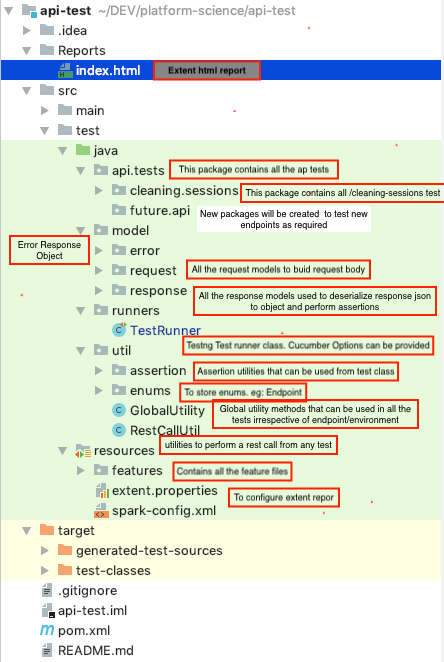

# api-test
This repo utilizes rest-assured, testNG and cucumber framework to test platform-science apis.

## **Steps to setup and execute the tests locally**

1. Install [JAVA](https://stackoverflow.com/questions/24342886/how-to-install-java-8-on-mac)
2. Install [Maven](https://maven.apache.org/install.html) 
3. Install Intellij or other JAVA IDE
4. Go to Project root in terminal (path: /api-test)
5. Execute ***mvn clean***
6. Execute ***mvn clean install***
7. Execute ***mvn test*** to trigger the tests from command line **or** right click on ***runners.TestRunner*** and and click on ***"Run 'Test Runner'"***

## **Directory Structure**

***Note:*** All the classes and the methods have the comments that will help to understand the code 

## ***Test Reporting***
This repo utilizes **Extent Reports** and generates a beautiful dashboard

**_Note:_** Anyone can view the [latest test report](https://manoadepu.github.io/api-test/Reports/index.html#) as it is integrated with github pages. 
